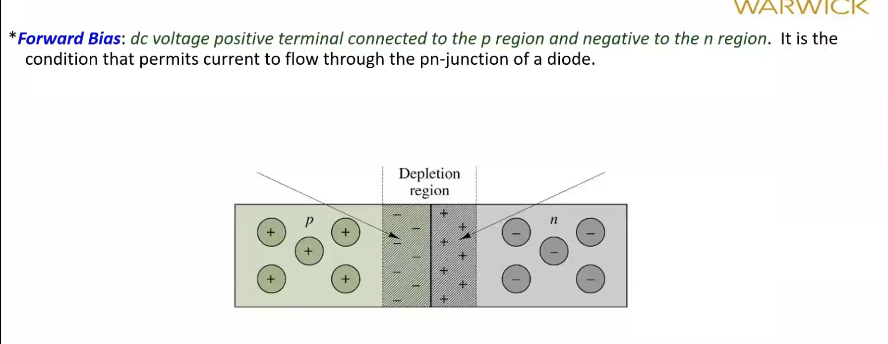

# Divider and Diodes

## Voltage Divider

$$
V_{out} = V\frac{R_2}{R_1 + R_2}

$$

Thevinin Resistance

$$
R_{th} = \frac{R_1R_2}{R_1+R_2}

$$

### Example 1

Design a potenital divider to give $V_{th} = 2.7V$ with $R_{th}=120k\Omega$ with a supply of $V_{in} = 10V$.

Rearrange Thevinin resistance to give $\frac{R_{th}}{R_1} = \frac{R_2}{R_1+R_2}$ and substitute into potential divider equation, then rearrange to give $R_1 = V\frac{R_{th}}{V_{th}}=444k\Omega$. Then rearrange to give $R_2 = 164.4k\Omega$

## Tranistor

Why was the transistor created?

1 - Made to replace physical and mechanical switches. (**switching**)

2 - Signals became **attenuated** over long cables, therefore need amplification

### Entrinsic Silicon

Adds impurites to make a material *semi*conducting (change properties of bandgap)

There are 2 types: **p-type** and **n-type**.

These materials which have mostly hole (absence of an electron) carrieres (**p**positive) or electron carriers (**n**egative).

Gives ways of modifying band gap energies (imporatnt for electronics detctors etc.)

### Semi Conductor Tables

Can see that semi conductors resistivity are within the range of insulators and conductors. ($10^{-3} < \rho < 10^5$). Can change resistivity by changing dopes.

Resistivity:

$$
R=\frac{\rho L}{A}

$$

### Baising the pn junction

Where $V_T$ = the thermal voltage = $\frac{kT}{q} \approx$ 25mV @  Room Temperature.
Basically one way valve.

$V_{bi}$ = Built in barrier voltage $\approx$ 0.7V.

#### **Forward Bias**

Small voltage drop to counteract the barrier voltage. (0.7V)

#### Reverse Breakdown

#### Shockly Equation

### Analysis

### Load Line Analysis

### Piecewise Linear Diode Models

